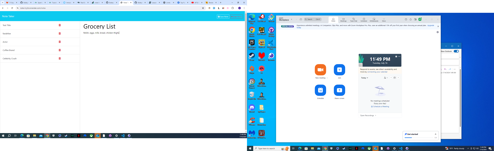

# Note-It

## Description

Note-taking application designed to make daily life easier

## Table of Contents

- [Installation](#installation)
- [Usage](#usage)
- [Contributions](#contributions)
- [License](#license)

## Installation

Open the link for the deployed application on Render and bookmark it

## Usage

Click on Get started and enter title and text then save form

## Contributions

Fork the repository then do a pull request

## License

MIT

## Badges

## Tests

N/A

## Contact

**Email: mailto:jalenwilliams90@yahoo.com**

**GitHub: [BobbyValet304](https://github.com/BobbyValet304)**

Link to application: https://note-it-j2xl.onrender.com/
